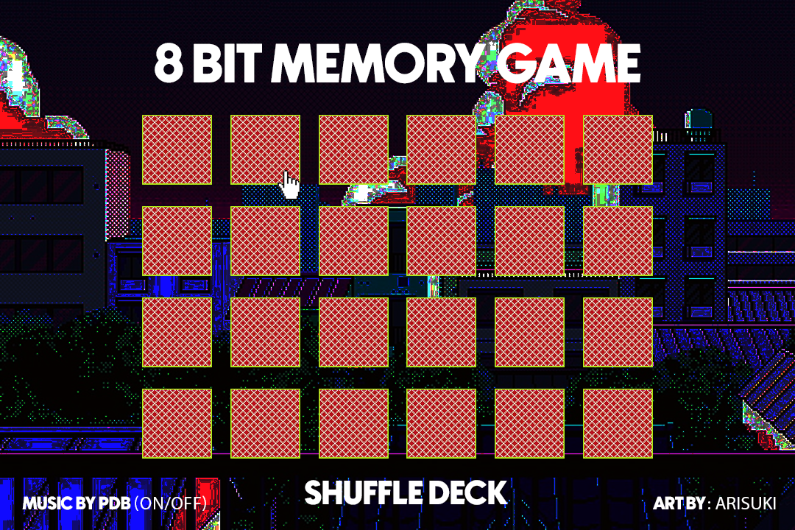
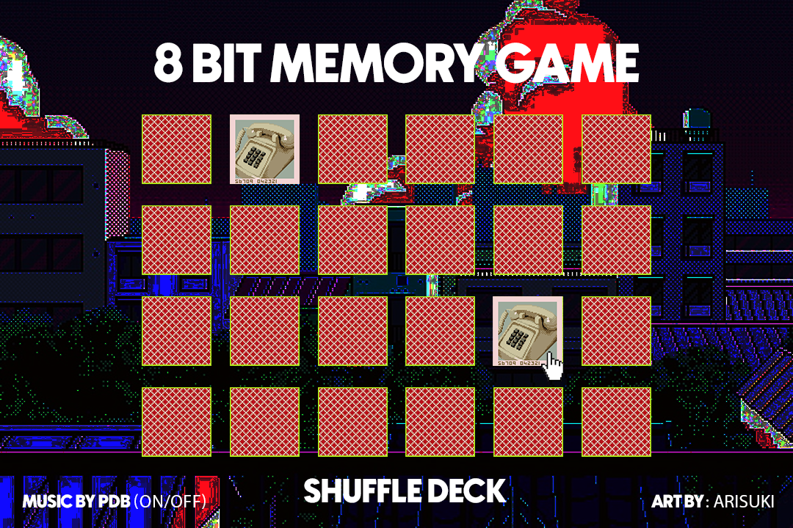

## GAME TITLE

- "MEMORY CARD MATCHING GAME"

##### GAME INFORMATION
#### Overview

- First published in today's form by Ravensburger in February 1959.

- In USA and England known as "Pairs", "Pelmanism", or "Concentration". But these are played with simple playing cards.

------------------

## How to Play

SETUP: 24 CARDS / 12 Pairs of images

OBJECT: To find the most pairs of matching picture cards.

HOW TO PLAY: 

SOLO PLAY: Cards start turned over.  Set up the game as described above, using any number of pairs, and count the number of turns it takes you to match them all. Try to improve with each game you play.

A MATCH: A player makes a match if the two cards turned picture-side-up are identical. When a match is made, the player takes both cards and places them in front of him/her. That player takes another turn, and continues taking turns until he/she misses.

A MISS:  A player misses if the two cards turned picture-side-up are not identical. That player’s turn ends. All players should try to remember which cards were turned over for future matches! The game continues until all possible matches have been made and those cards have been removed from the playing area. 

WINNING:  If you have the most pairs of matching cards, you win!

-----------------

##### TECHNOLOGIES USED
- HTML, CSS and JavaScript

-----------------

##### ART

- 12 8-BIT PIXELATED DRAWINGS BY ARISUKI

-----------------
##### SCREENSHOTS

----------------
##### MVP
Game Starts
  - 24 CARDS SHUFFLE / 12 PAIRS
  - IF CARDS MATCH, CARDS REMAIN REVEALED / IF THEY DONT THEY TURN 
  - RESHUFFLE
  - MATCHING ICONS BY ALICE
  - BACKGROUND MUSIC AND SFX

##### FUTURE DEVELOPMENT
  - 2 PLAYER GAME
  - IF CARDS MATCHES PLAYER1 CONTINUES / OTHERWISE PLAYER2 TURN
  - SCORE IS KEPT / WHOMEVER TURNS MORE WINS 6-6 MEANS TIE

## PSEUDOCODE MVP 
  - A FUNCTION THAT STARTS THE GAME (RESTART BUTTON)
    1. SHUFFLES DECK (ARRAY of OBJECTS) - FRONT/BACK/DISCOVER
  - IN JS I WILL NEED A FUNCTION THAT REPLACES THE BACKGROUND OF EACH div ELEMENT (CARD) WHEN CLICKED
    1. ELEMENTS WILL CONTAIN A "NAME" (IDs DONT ALLOW INTEGERS) REFERENCING THE ARRAY INDEX.
    2. TWO VARIABLES: FIRST ONE STORES ARRAY INDEX FROM THE FIRST SELECTION. SECOND ONE STORES ARRAY INDEX FROM THE SECOND SELECTION.
  - A CONDITIONAL THAT CHECKS WHETHER SELECTION 1 EQUALS SELECTION 2. AND CHECKS WETHER THE CARD CHOSEN WAS A MATCH, OTHERWISE TURNING BOTH AROUND.
     
     EXTRA STUFF
  - A FUNCTION THAT KEEPS TRACK OF WHO'S TURN IS IT. AND WHO'S WINNING AT A GIVEN TIME.
